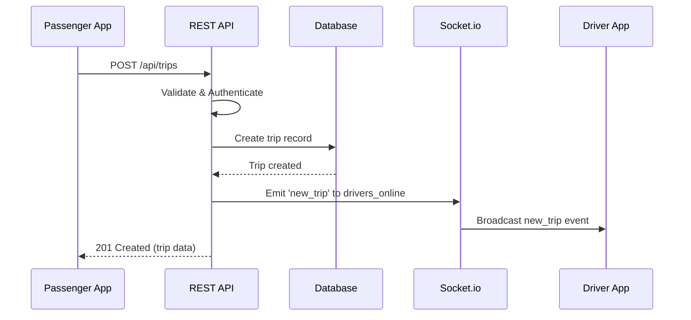
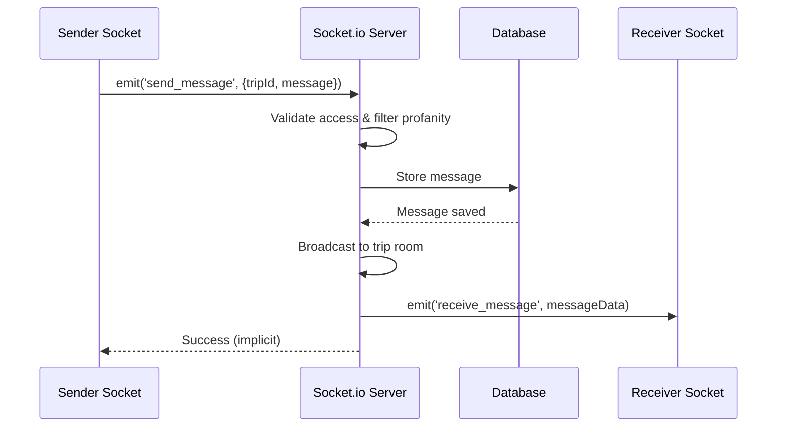
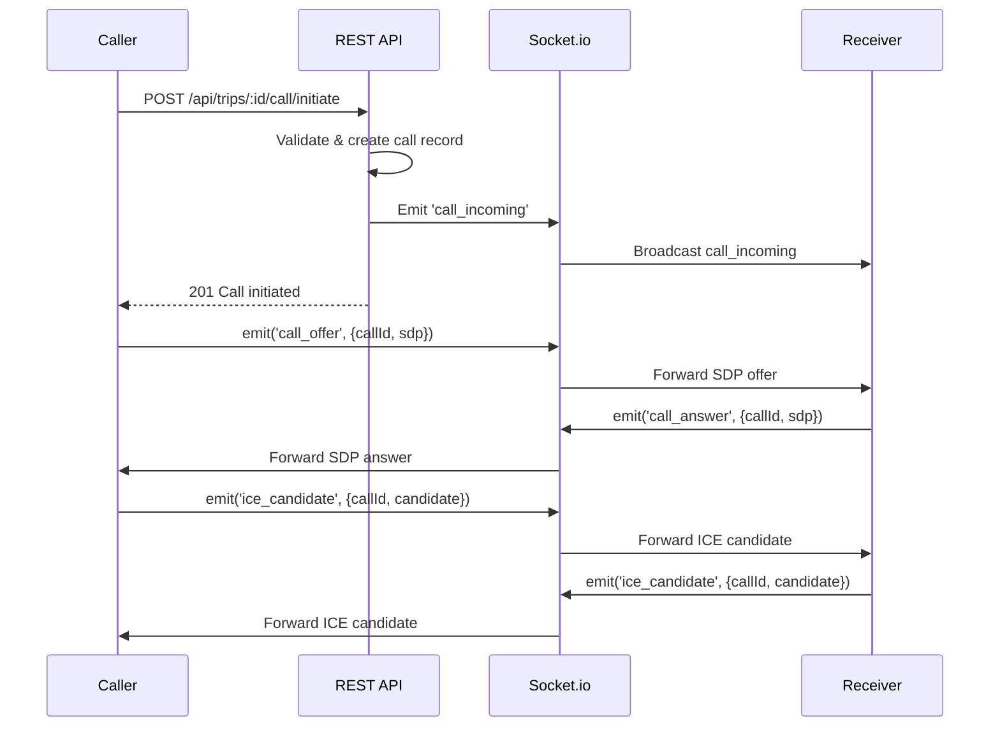
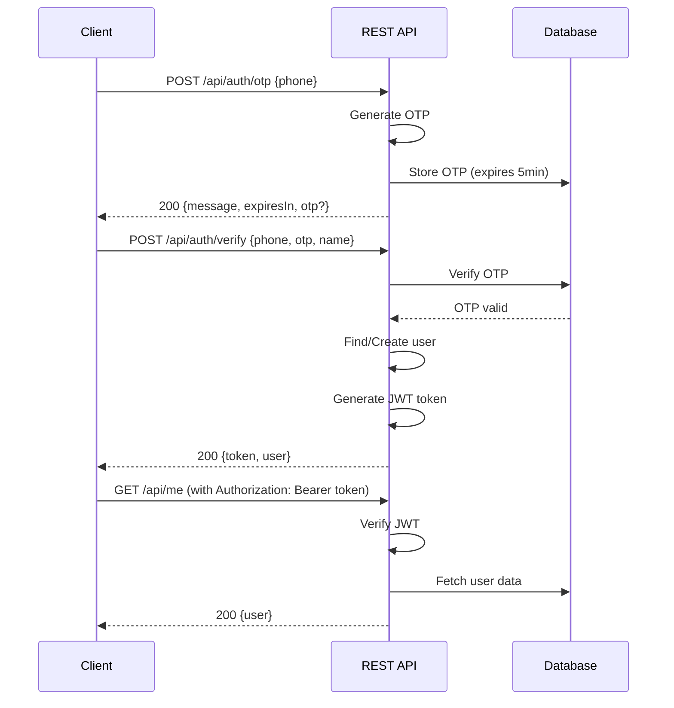

# SafeRide Women - System Architecture

Complete system architecture documentation for the SafeRide Women backend server.

---

## Table of Contents

- [High-Level Architecture](#high-level-architecture)
- [Component Breakdown](#component-breakdown)
- [Technology Stack](#technology-stack)
- [Data Flow Diagrams](#data-flow-diagrams)
- [Socket.io + REST Interplay](#socketio--rest-interplay)
- [Security Layers](#security-layers)
- [Database Structure](#database-structure)
- [Scalability Roadmap](#scalability-roadmap)

---

## High-Level Architecture

### System Overview

```
┌─────────────────────────────────────────────────────────────────┐
│                        Mobile App Layer                         │
│                  (React Native - iOS/Android)                   │
└────────────┬───────────────────────────────────┬────────────────┘
             │                                   │
             │ HTTP/REST                         │ WebSocket
             │                                   │
┌────────────▼───────────────────────────────────▼────────────────┐
│                     Backend Server Layer                        │
│                    (Node.js + Express.js)                       │
│                                                                  │
│  ┌──────────────────┐          ┌──────────────────┐            │
│  │   REST API       │          │   Socket.io      │            │
│  │   (Express.js)   │◄────────►│   (Real-time)    │            │
│  │                  │          │                  │            │
│  │  25+ Endpoints   │          │  12+ Events      │            │
│  └────────┬─────────┘          └────────┬─────────┘            │
│           │                              │                       │
│           └──────────────┬───────────────┘                       │
│                          │                                       │
│           ┌──────────────▼───────────────┐                      │
│           │   Business Logic Layer       │                      │
│           │   - Authentication           │                      │
│           │   - Trip Management          │                      │
│           │   - Chat & Calls             │                      │
│           │   - Safety Features          │                      │
│           └──────────────┬───────────────┘                      │
│                          │                                       │
│           ┌──────────────▼───────────────┐                      │
│           │   Security Middleware        │                      │
│           │   - JWT Verification         │                      │
│           │   - Rate Limiting            │                      │
│           │   - CORS                     │                      │
│           │   - Helmet                   │                      │
│           └──────────────┬───────────────┘                      │
│                          │                                       │
└──────────────────────────┼───────────────────────────────────────┘
                           │
           ┌───────────────▼───────────────┐
           │      Data Layer               │
           │   (PostgreSQL)                │
           │                               │
           │   - Connection Pooling        │
           │   - SQL Queries               │
           │   - Transaction Support       │
           │   - ACID Compliance           │
           │                               │
           │   Note: OTP codes still       │
           │   in-memory (Redis planned)   │
           └───────────────────────────────┘
```

---

## Component Breakdown

### 1. Server Entry Point (`server.js`)

**Location:** Root directory  
**Size:** 2,331 lines  
**Sections:**

```
server.js
├── Section 1: Dependencies & Configuration
├── Section 2: In-Memory Database Structure
├── Section 3: Security Middleware
├── Section 4: Authentication Middleware
├── Section 5: Socket.io Real-Time Setup
├── Section 6: Helper Functions
├── Section 7: Authentication Endpoints
├── Section 8: User Profile Endpoints
├── Section 9: Trip Management Endpoints
├── Section 10: Offer Management Endpoints
├── Section 11: Trip Action Endpoints
├── Section 12: Rating System Endpoints
├── Section 13: Driver Management Endpoints
├── Section 14: SOS Emergency Endpoints
├── Section 15: Admin Endpoints
├── Section 16: Health Check Endpoint
├── Section 17: Error Handlers
└── Section 18: Server Startup
```

---

### 2. PostgreSQL Database

**Structure:**
- PostgreSQL database with connection pooling
- SQL-based queries via `db/queries.js`
- ACID-compliant transactions
- Persistent data storage

**Schema:**
- `users` - User accounts
- `drivers` - Driver profiles
- `trips` - Trip records
- `offers` - Driver offers
- `ratings` - Trip ratings
- `messages` - Chat messages
- `calls` - Voice call records
- `sos_events` - Emergency alerts
- `refresh_tokens` - Token management
- `revoked_tokens` - Token revocation list

**Characteristics:**
- Persistent data storage
- ACID compliance
- Connection pooling (max 20 connections)
- SQL query optimization
- Transaction support
- Note: OTP codes still in-memory (Redis migration planned)

---

### 3. REST API Layer

**Framework:** Express.js 4.x  
**Port:** 4000 (configurable via `PORT`)  
**Endpoints:** 25+ routes organized by feature

**Route Groups:**
- `/api/auth/*` - Authentication
- `/api/me` - User profile
- `/api/trips/*` - Trip management
- `/api/drivers/*` - Driver operations
- `/api/sos` - Emergency alerts
- `/api/admin/*` - Admin panel

---

### 4. Socket.io Real-Time Layer

**Library:** Socket.io 4.x  
**Transports:** WebSocket, Polling (configurable)  
**Events:** 12+ event types

**Event Categories:**
- Connection Management (`authenticate`, `join_trip`)
- Location Tracking (`location_update`, `driver_online`)
- Chat Messaging (`send_message`, `receive_message`, `typing_indicator`)
- Voice Calls (`call_initiate`, `call_offer`, `call_answer`, `ice_candidate`)
- Trip Updates (`new_trip`, `new_offer`, `offer_accepted`, `trip_started`)
- Emergency (`sos_alert`)

---

### 5. Authentication & Authorization

**Authentication:**
- JWT tokens (7-day expiry)
- OTP verification (6-digit, 5-minute expiry)
- Token-based Socket.io authentication

**Authorization:**
- Role-based access control (RBAC)
- Roles: `admin`, `passenger`, `driver`
- Endpoint-level authorization middleware

**Flow:**
```
User Request
    │
    ├─► Authentication Middleware (JWT verification)
    │       │
    │       ├─► Valid Token → Extract userId, role
    │       └─► Invalid Token → 403 Forbidden
    │
    └─► Authorization Middleware (Role check)
            │
            ├─► Authorized → Process request
            └─► Unauthorized → 403 Access Denied
```

---

### 6. Security Middleware

**Helmet.js:**
- Security headers (XSS, CSRF protection)
- Content Security Policy
- HSTS

**Rate Limiting:**
- Auth endpoints: 5 requests / 15 minutes
- General API: 100 requests / minute
- Express-rate-limit library

**CORS:**
- Configurable origins (production: restricted)
- Development: `*` (all origins)
- Production: Comma-separated list

**Input Validation:**
- Phone number format
- Coordinate validation (latitude/longitude)
- Price validation (positive numbers)
- Message length limits (1000 chars)
- Profanity filtering (bad-words library)

---

## Technology Stack

### Runtime & Framework

- **Node.js** 16+ - JavaScript runtime
- **Express.js** 4.x - Web framework
- **Socket.io** 4.x - Real-time communication

### Authentication & Security

- **jsonwebtoken** 9.x - JWT token generation/verification
- **helmet** 7.x - Security headers
- **express-rate-limit** 7.x - Rate limiting
- **cors** 2.x - Cross-origin resource sharing
- **bad-words** 3.x - Profanity filtering

### Database & Storage

- **pg** 8.x - PostgreSQL driver with connection pooling

### Error Tracking & Logging

- **@sentry/node** 9.x - Error tracking and performance monitoring
- **pino** 10.x - Fast JSON logger

### Utilities

- **dotenv** 16.x - Environment variable management

---

## Data Flow Diagrams

### 1. Trip Request Flow



### 2. Chat Message Flow



### 3. Voice Call Signaling Flow



### 4. Authentication Flow



---

## Socket.io + REST Interplay

### Dual Communication Pattern

The system uses both REST and Socket.io strategically:

**REST API:**
- State-changing operations (CRUD)
- One-time requests
- Request-response pattern
- Stateless operations

**Socket.io:**
- Real-time notifications
- Bidirectional communication
- Persistent connections
- Event-driven updates

### Combined Flow Example: Trip Acceptance

```
1. REST: Driver makes offer
   POST /api/trips/:id/offers
   ↓
2. Socket.io: Passenger receives notification
   emit('new_offer', offerData)
   ↓
3. REST: Passenger accepts offer
   POST /api/trips/:id/accept
   ↓
4. Socket.io: Driver receives notification
   emit('offer_accepted', {trip_id, offer_id})
```

### Room-Based Broadcasting

**Trip Rooms:**
- Format: `trip_{tripId}`
- Members: Passenger, Driver, Admin (if authorized)
- Events: Messages, calls, trip updates

**Global Rooms:**
- `drivers_online` - All online drivers
- Global broadcasts: `sos_alert`

**User Tracking:**
- `connectedUsers` Map: `userId → Set<socketId>`
- Supports multiple devices per user
- Automatic cleanup on disconnect

---

## Security Layers

### Defense-in-Depth Strategy

```
┌─────────────────────────────────────────┐
│ Layer 1: Network Security               │
│ - HTTPS (production)                    │
│ - Firewall rules                        │
│ - Port restrictions                     │
└─────────────────────────────────────────┘
           │
           ▼
┌─────────────────────────────────────────┐
│ Layer 2: Application Security           │
│ - Helmet.js headers                     │
│ - CORS policy                           │
│ - Rate limiting                         │
└─────────────────────────────────────────┘
           │
           ▼
┌─────────────────────────────────────────┐
│ Layer 3: Authentication                 │
│ - JWT token verification                │
│ - OTP expiration                        │
│ - Token expiry (7 days)                 │
└─────────────────────────────────────────┘
           │
           ▼
┌─────────────────────────────────────────┐
│ Layer 4: Authorization                  │
│ - Role-based access control             │
│ - Resource ownership checks             │
│ - Endpoint-level permissions            │
└─────────────────────────────────────────┘
           │
           ▼
┌─────────────────────────────────────────┐
│ Layer 5: Input Validation               │
│ - Request validation                    │
│ - Data sanitization                     │
│ - Profanity filtering                   │
└─────────────────────────────────────────┘
           │
           ▼
┌─────────────────────────────────────────┐
│ Layer 6: Data Protection                │
│ - User data sanitization                │
│ - Sensitive field filtering             │
│ - Error message sanitization            │
└─────────────────────────────────────────┘
```

### Security Features

**Rate Limiting:**
- Prevents brute force attacks
- DDoS protection
- Auth endpoint protection (5/15min)
- API endpoint protection (100/min)

**JWT Security:**
- Secret key in environment variable
- Token expiration (7 days)
- Secure token generation
- Signature verification

**Input Validation:**
- Phone number format
- Coordinate bounds checking
- Price validation
- Message length limits
- Profanity filtering

**Error Handling:**
- No sensitive data in error messages
- Consistent error format
- Proper HTTP status codes
- Error logging without exposure

---

## Database Structure

### Entity Relationship Diagram (Conceptual)

```
┌──────────┐         ┌──────────┐
│   User   │─────────│  Driver  │ (1:1, optional)
│          │         │          │
│ - id     │         │ - id     │
│ - phone  │         │ - license│
│ - name   │         │ - vehicle│
│ - role   │         │ - rating │
└────┬─────┘         └────┬─────┘
     │                    │
     │                    │
     │ 1:N                │ 1:N
     │                    │
┌────▼─────┐         ┌────▼─────┐
│   Trip   │         │  Offer   │
│          │◄────────│          │
│ - id     │   1:N   │ - id     │
│ - status │         │ - price  │
│ - pickup │         │ - eta    │
│ - drop   │         └──────────┘
└────┬─────┘
     │
     │ 1:N
     │
┌────▼─────┐         ┌──────────┐
│ Message  │         │   Call   │
│          │         │          │
│ - id     │         │ - id     │
│ - content│         │ - status │
│ - flagged│         │ - sdp    │
└──────────┘         └──────────┘

┌──────────┐         ┌──────────┐
│  Rating  │         │ SOSEvent │
│          │         │          │
│ - id     │         │ - id     │
│ - rating │         │ - status │
│ - comment│         │ - location│
└──────────┘         └──────────┘
```

### Data Models

**User:**
```javascript
{
  id: number,
  phone: string,
  name: string,
  role: 'admin' | 'passenger' | 'driver',
  verified: boolean,
  createdAt: Date,
  emergencyContact: string | null,
  trustedContacts: string[]
}
```

**Driver:**
```javascript
{
  id: number,
  userId: number,
  licenseNumber: string,
  vehicleMake: string,
  vehicleModel: string,
  vehiclePlate: string,
  vehicleYear: number | null,
  verificationStatus: 'pending' | 'verified' | 'rejected',
  rating: number,
  totalTrips: number,
  isOnline: boolean,
  lastLocationLat: number | null,
  lastLocationLng: number | null,
  createdAt: Date
}
```

**Trip:**
```javascript
{
  id: number,
  passengerId: number,
  driverId: number | null,
  pickupLat: number,
  pickupLng: number,
  pickupAddress: string,
  dropLat: number,
  dropLng: number,
  dropAddress: string,
  status: 'requested' | 'accepted' | 'in_progress' | 'completed' | 'cancelled',
  proposedPrice: number,
  acceptedPrice: number | null,
  createdAt: Date,
  startedAt: Date | null,
  completedAt: Date | null,
  sharedWith: string[],
  safetyCheckEnabled: boolean
}
```

---

## Scalability Roadmap

### Current State (v1.0)

- ✅ PostgreSQL database with connection pooling
- ✅ Sentry error tracking
- ✅ Single server instance
- ✅ Basic rate limiting
- ✅ Socket.io with polling fallback

### Phase 1: Caching Layer (Next)

**Goal:** Improve performance

**Changes:**
- Add Redis for caching
- Cache frequently accessed data (users, drivers)
- Session storage in Redis
- OTP storage in Redis (with TTL)

---

### Phase 2: Caching Layer

**Goal:** Improve performance

**Changes:**
- Add Redis for caching
- Cache frequently accessed data (users, drivers)
- Session storage in Redis
- OTP storage in Redis (with TTL)

**Benefits:**
- Faster response times
- Reduced database load
- Better scalability

---

### Phase 3: Horizontal Scaling

**Goal:** Support multiple server instances

**Changes:**
- Redis adapter for Socket.io (multi-server support)
- Load balancer (nginx/HAProxy)
- Shared session storage
- Database connection pooling

**Benefits:**
- High availability
- Load distribution
- Fault tolerance

---

### Phase 4: Microservices

**Goal:** Separate concerns into services

**Services:**
- Authentication Service
- Trip Service
- Chat Service
- Notification Service
- Admin Service

**Benefits:**
- Independent scaling
- Technology flexibility
- Easier maintenance
- Team autonomy

---

### Phase 5: Advanced Features

**Enhancements:**
- Push notifications (FCM/APNS)
- SMS integration (Twilio)
- Payment gateway integration
- Real-time analytics
- Machine learning (fraud detection, route optimization)

---

## Deployment Architecture

### Development

```
Developer Machine
    │
    ├─► Node.js server (localhost:4000)
    ├─► PostgreSQL (local)
    └─► Socket.io (WebSocket + Polling)
```

### Production (Current)

```
Single Server
    │
    ├─► Node.js + Express.js
    ├─► Socket.io Server
    ├─► PostgreSQL Database
    ├─► Sentry Error Tracking
    └─► Environment Variables
```

### Production (Future)

```
                    ┌─────────────┐
                    │ Load Balancer│
                    │   (nginx)   │
                    └──────┬──────┘
                           │
        ┌──────────────────┼──────────────────┐
        │                  │                  │
   ┌────▼────┐        ┌────▼────┐       ┌────▼────┐
   │ Server 1│        │ Server 2│       │ Server N│
   │(Node.js)│        │(Node.js)│       │(Node.js)│
   └────┬────┘        └────┬────┘       └────┬────┘
        │                  │                  │
        └──────────────────┼──────────────────┘
                           │
                    ┌──────▼──────┐
                    │   Redis     │
                    │  (Cache +   │
                    │  Sessions)  │
                    └──────┬──────┘
                           │
                    ┌──────▼──────┐
                    │ PostgreSQL  │
                    │  (Database) │
                    └─────────────┘
```

---

## Performance Considerations

### Current Optimizations

- PostgreSQL connection pooling (max 20 connections)
- SQL query optimization
- Rate limiting
- Profanity filtering (cached)
- JWT verification (stateless)
- Sentry performance monitoring
- Pino structured logging

### Bottlenecks (Identified)

- Single server instance
- No caching layer (Redis planned)
- OTP still in-memory
- Database query optimization needed

### Future Optimizations

- Database indexing
- Query optimization
- CDN for static assets
- WebSocket connection pooling
- Background job processing (Bull/Agenda)

---

## Monitoring & Logging

### Current Logging

- Pino structured logging (JSON format)
- Error tracking via Sentry
- Socket connection tracking
- SOS alert logging
- Database query logging
- Performance monitoring (Sentry)

### Future Enhancements

- Log aggregation (ELK Stack)
- Metrics collection (Prometheus)
- Advanced Sentry integrations
- Real-time dashboards
- Custom logging dashboards

---

**Last Updated:** January 2024  
**Architecture Version:** 1.0.0

